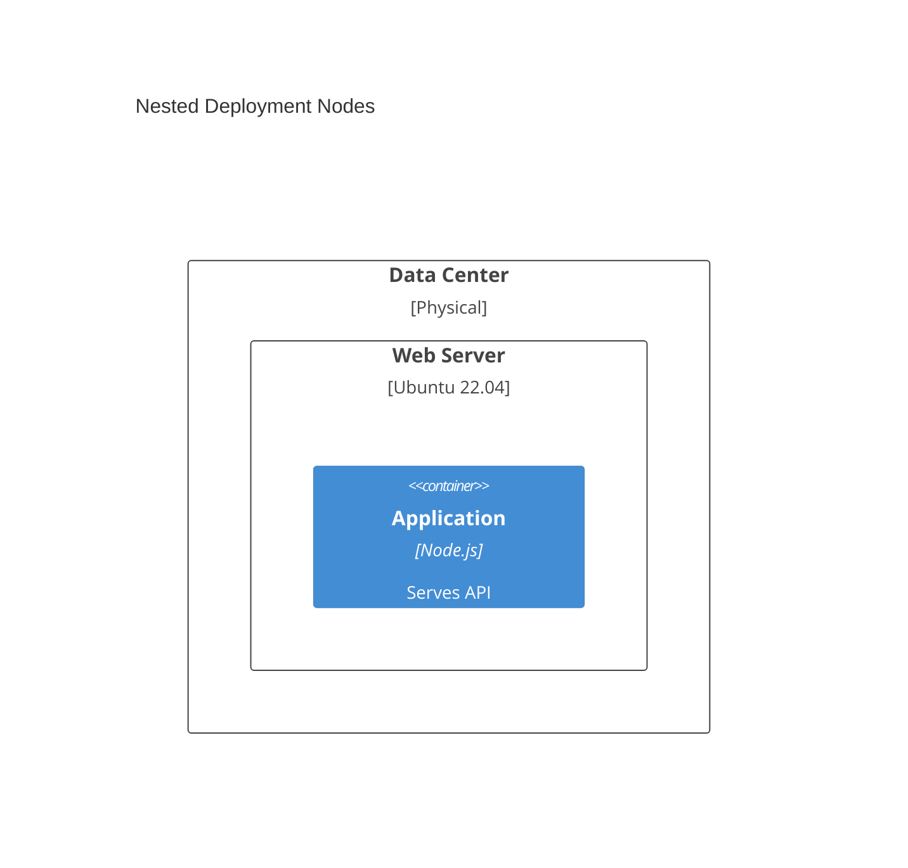
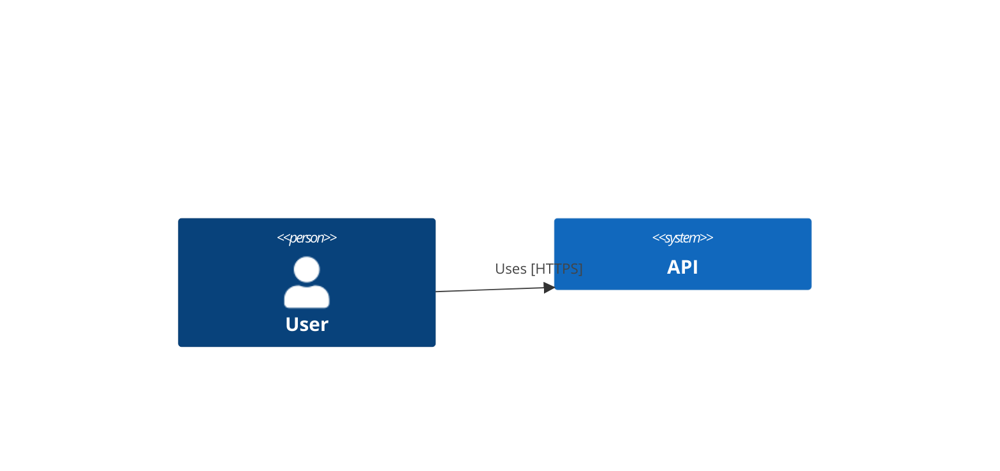
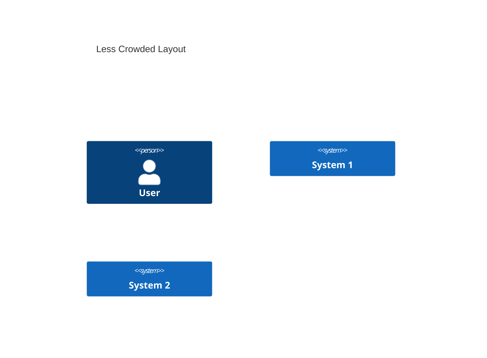
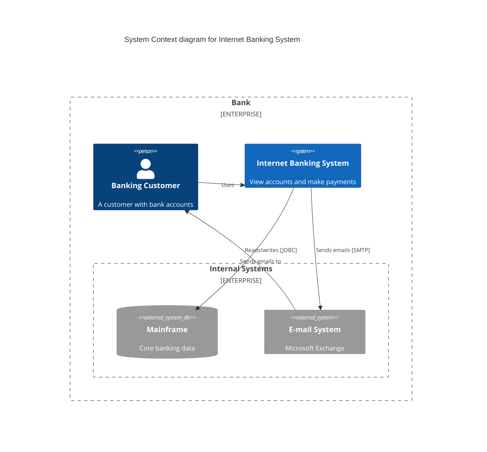
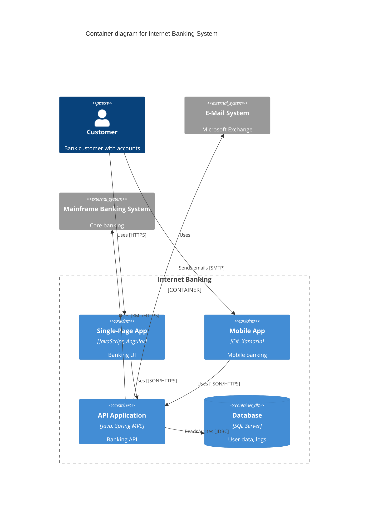
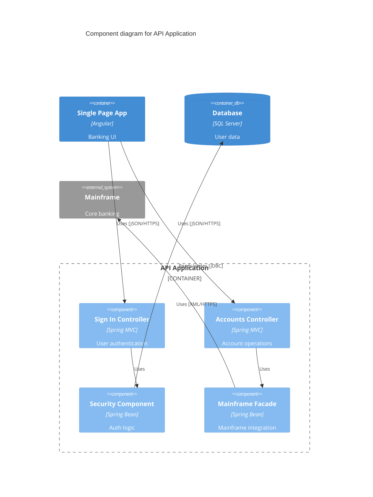
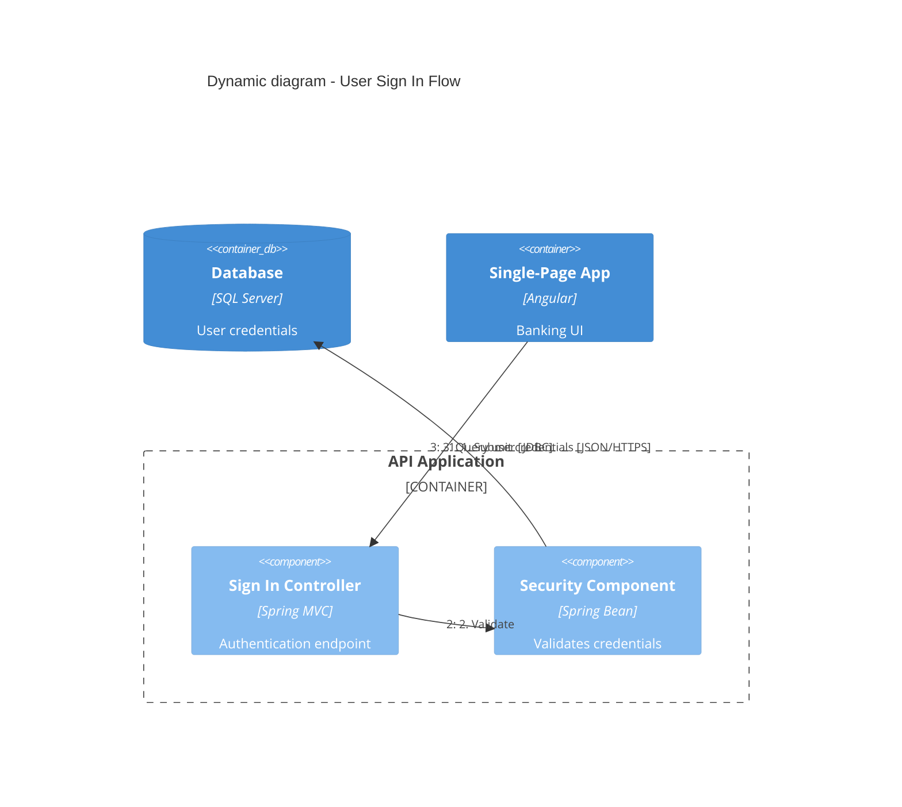
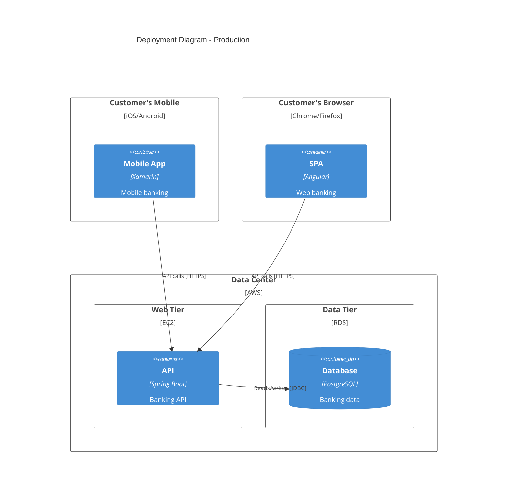
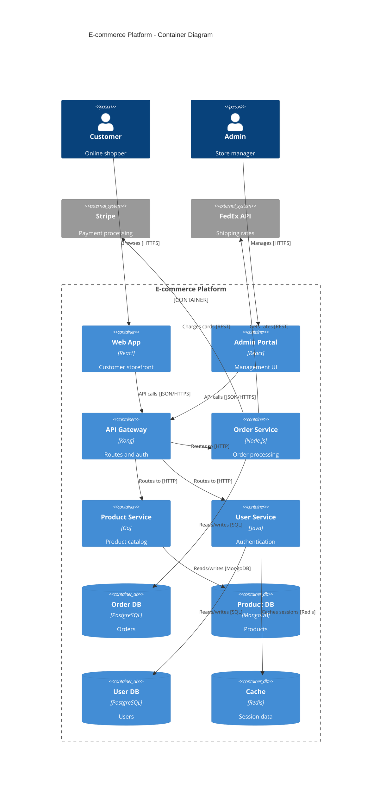
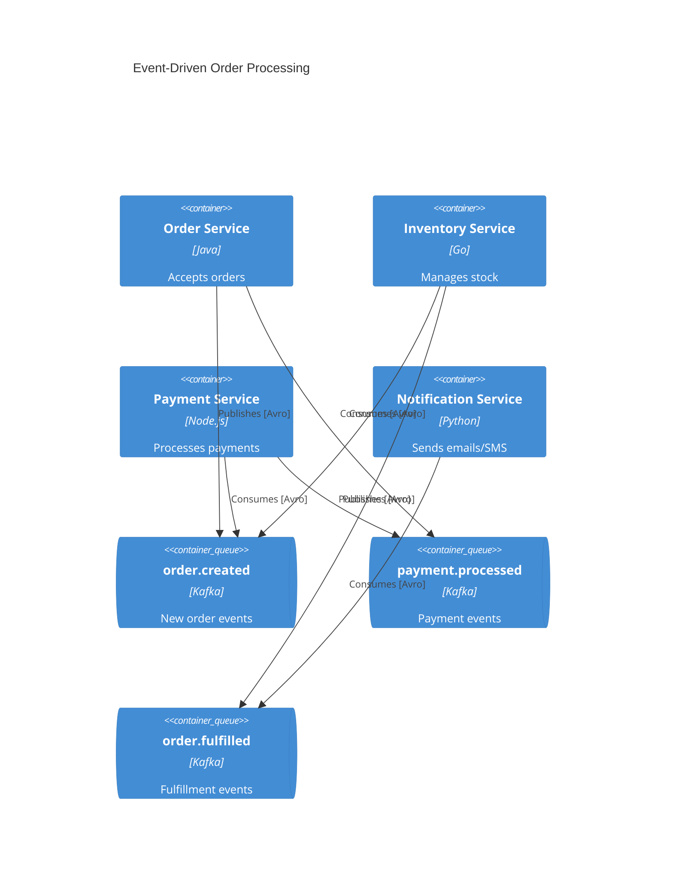

# C4 Mermaid Diagram Syntax Reference

Syntax reference aligned with the [official Mermaid C4 documentation](https://mermaid.js.org/syntax/c4). PlantUML-compatible where noted.

> **Experimental:** Mermaid C4 is experimental — syntax may change between releases.

> **Fixed styling:** C4 diagrams use fixed CSS colors; Mermaid skins do not restyle them.

## Table of Contents

1. [Diagram Types](#diagram-types)
2. [System Context Elements](#system-context-elements)
3. [Container Elements](#container-elements)
4. [Component Elements](#component-elements)
5. [Deployment Elements](#deployment-elements)
6. [Relationship Types](#relationship-types)
7. [Boundaries](#boundaries)
8. [Styling](#styling)
9. [Layout Configuration](#layout-configuration)
10. [Parameter Syntax](#parameter-syntax)
11. [Complete Examples](#complete-examples)
12. [Mermaid Limitations](#mermaid-limitations)

## Diagram Types

Start each diagram with the appropriate type declaration:

| Type | Declaration | Purpose |
|------|-------------|---------|
| System Context | `C4Context` | Shows system in context with users and external systems |
| Container | `C4Container` | Shows high-level technical building blocks |
| Component | `C4Component` | Shows internal components within a container |
| Dynamic | `C4Dynamic` | Shows request flows with numbered sequence |
| Deployment | `C4Deployment` | Shows infrastructure and deployment nodes |

## System Context Elements

### Person
```
Person(alias, label, ?descr)
Person_Ext(alias, label, ?descr)    # External person
```

### System
```
System(alias, label, ?descr)
System_Ext(alias, label, ?descr)    # External system
SystemDb(alias, label, ?descr)      # Database system
SystemDb_Ext(alias, label, ?descr)  # External database
SystemQueue(alias, label, ?descr)   # Message queue
SystemQueue_Ext(alias, label, ?descr)
```

## Container Elements

### Container
```
Container(alias, label, ?techn, ?descr)
Container_Ext(alias, label, ?techn, ?descr)
ContainerDb(alias, label, ?techn, ?descr)
ContainerDb_Ext(alias, label, ?techn, ?descr)
ContainerQueue(alias, label, ?techn, ?descr)
ContainerQueue_Ext(alias, label, ?techn, ?descr)
```

## Component Elements

### Component
```
Component(alias, label, ?techn, ?descr)
Component_Ext(alias, label, ?techn, ?descr)
ComponentDb(alias, label, ?techn, ?descr)
ComponentDb_Ext(alias, label, ?techn, ?descr)
ComponentQueue(alias, label, ?techn, ?descr)
ComponentQueue_Ext(alias, label, ?techn, ?descr)
```

## Deployment Elements

### Deployment Node
```
Deployment_Node(alias, label, ?type, ?descr) { ... }
Node(alias, label, ?type, ?descr) { ... }      # Shorthand
Node_L(alias, label, ?type, ?descr) { ... }    # Left-aligned
Node_R(alias, label, ?type, ?descr) { ... }    # Right-aligned
```

Deployment nodes can be nested:


## Relationship Types

### Rel (default — always use when generating)

Official signature:

```
Rel(from, to, label, ?techn, ?descr, ?sprite, ?tags, $link)
```

Common usage:

```
Rel(from, to, label)
Rel(from, to, label, techn)
Rel(from, to, label, techn, descr)
```

Technology can also appear in the label: `Rel(a, b, "Uses [HTTPS]")`.

### PlantUML-compatible variants (supported by Mermaid, do not use when generating)

Mermaid parses these for PlantUML compatibility ([official support list](https://mermaid.js.org/syntax/c4)):

| Variant | Mermaid status |
|---------|----------------|
| `BiRel` | Supported — bidirectional arrow |
| `Rel_U`, `Rel_Up` | Supported — upward arrow |
| `Rel_D`, `Rel_Down` | Supported — downward arrow |
| `Rel_L`, `Rel_Left` | Supported — leftward arrow |
| `Rel_R`, `Rel_Right` | Supported — rightward arrow |
| `Rel_Back` | Supported — reverse direction |

**Critical:** These change arrow rendering only. They do **not** move boxes. Mermaid has no auto-layout — shape position is set by **declaration order**. Never substitute `Rel_U`/`Rel_D` for layout fixes; declare elements in the visual order you want.

**When generating diagrams:** use `Rel` only. Use two `Rel` statements instead of `BiRel`.

### Layout directives (listed but unimplemented)

```
Lay_U, Lay_Up, Lay_D, Lay_Down, Lay_L, Lay_Left, Lay_R, Lay_Right
```

Mermaid lists these in the docs but **has not implemented them**. Use declaration order + `UpdateLayoutConfig` instead.

### Dynamic Diagram Relationships
```
RelIndex(index, from, to, label)
```
`index` is ignored; sequence follows `Rel` / `RelIndex` statement order.

## Boundaries

### Enterprise Boundary
```
Enterprise_Boundary(alias, label) {
  # Systems and people go here
}
```

### System Boundary
```
System_Boundary(alias, label) {
  # Containers go here
}
```

### Container Boundary
```
Container_Boundary(alias, label) {
  # Components go here
}
```

### Generic Boundary
```
Boundary(alias, label, ?type) {
  # Elements go here
}
```

## Styling

Style calls go at the **end** of the diagram (after all elements and `Rel` statements).

> **Case sensitivity quirk:** Mermaid documents that lowercase `updateElementStyle` is inconsistent with PlantUML — it may affect **relationship** label offset instead of element style. Always use PascalCase: `UpdateElementStyle` for elements, `UpdateRelStyle` for relationships.

### UpdateElementStyle

Official signature:

```
UpdateElementStyle(elementName, ?bgColor, ?fontColor, ?borderColor, ?shadowing, ?shape, ...)
```

Positional order: `bgColor`, `fontColor`, `borderColor`, `shadowing`, `shape`.

Named parameters (required when generating code):

```
UpdateElementStyle(api, $bgColor="lightgrey", $fontColor="red", $borderColor="red")
```

### UpdateRelStyle

Official signature:

```
UpdateRelStyle(from, to, ?textColor, ?lineColor, ?offsetX, ?offsetY)
```

Positional order: `textColor`, `lineColor`, `offsetX`, `offsetY`.

Official examples from Mermaid docs:

```
UpdateRelStyle(customerA, bankA, "red", "blue", "-40", "60")
UpdateRelStyle(customerA, bankA, $offsetX="-40", $offsetY="60", $lineColor="blue", $textColor="red")
UpdateRelStyle(customerA, bankA, $offsetY="60")
```

**When generating code, use named parameters only** — omit unused params instead of empty placeholders:

```
UpdateRelStyle(spa, api, $textColor="blue", $offsetY="-30")
```

Do **not** write `UpdateRelStyle(spa, api, "blue", "", "", "-30")`.

| Parameter | Purpose |
|-----------|---------|
| `textColor` | Label text color |
| `lineColor` | Arrow line color |
| `offsetX` | Horizontal label offset (pixels) |
| `offsetY` | Vertical label offset (pixels) |

**Tip:** Use `$offsetX` / `$offsetY` to fix overlapping relationship labels:



## Layout Configuration

From [Mermaid C4 docs](https://mermaid.js.org/syntax/c4):

> The layout does not use a fully automated layout algorithm. The position of shapes is adjusted by changing the order in which statements are written.

`UpdateLayoutConfig` only adjusts shapes/boundaries **per row** — it does not replace declaration order.

Official signature:

```
UpdateLayoutConfig(?c4ShapeInRow, ?c4BoundaryInRow)
```

- `c4ShapeInRow` — shapes per row (default: **4**)
- `c4BoundaryInRow` — boundaries per row (default: **2**)

**Declaration order rules:**
1. `title` first
2. Boundaries before nested elements inside `{ }`
3. Elements in top-to-bottom, left-to-right visual order
4. All `Rel` statements after elements
5. `UpdateLayoutConfig`, `UpdateElementStyle`, `UpdateRelStyle` **last**

**Example — reduce crowding:**



## Parameter Syntax

Mermaid supports two parameter styles for `UpdateElementStyle`, `UpdateRelStyle`, and `UpdateLayoutConfig`.

### Named parameters (required when generating code)

Prefix with `$`, any order, omit unused params:

```
UpdateRelStyle(customerA, bankA, $offsetX="-40", $offsetY="60", $lineColor="blue", $textColor="red")
UpdateElementStyle(api, $bgColor="lightgrey", $fontColor="red")
UpdateLayoutConfig($c4ShapeInRow="3", $c4BoundaryInRow="1")
```

### Positional parameters (reference only — do not use when generating)

Must be passed in exact order; empty strings required for skipped slots:

```
UpdateRelStyle(customerA, bankA, "red", "blue", "-40", "60")
```

Positional order for `UpdateRelStyle`: `textColor`, `lineColor`, `offsetX`, `offsetY`.
Positional order for `UpdateElementStyle`: `bgColor`, `fontColor`, `borderColor`, `shadowing`, `shape`.

## Complete Examples

### C4Context Example


### C4Container Example


### C4Component Example


### C4Dynamic Example


### C4Deployment Example


### E-commerce Microservices Example


### Event-Driven Architecture Example


### AWS Deployment Example
```mermaid
C4Deployment
  title Production Deployment - AWS

  Deployment_Node(cdn, "CloudFront", "CDN") {
    Container(static, "Static Assets", "S3", "HTML/CSS/JS")
  }

  Deployment_Node(vpc, "VPC", "10.0.0.0/16") {
    Deployment_Node(publicSubnet, "Public Subnet", "10.0.1.0/24") {
      Deployment_Node(alb, "Application Load Balancer", "ALB") {
        Container(lb, "Load Balancer", "AWS ALB", "Routes traffic")
      }
    }

    Deployment_Node(privateSubnet, "Private Subnet", "10.0.2.0/24") {
      Deployment_Node(ecs, "ECS Cluster", "Fargate") {
        Container(api1, "API Instance 1", "Node.js", "REST API")
        Container(api2, "API Instance 2", "Node.js", "REST API")
      }

      Deployment_Node(rds, "RDS", "Multi-AZ") {
        ContainerDb(primary, "Primary DB", "PostgreSQL", "Main database")
        ContainerDb(replica, "Read Replica", "PostgreSQL", "Read scaling")
      }
    }
  }

  Rel(cdn, alb, "Forwards requests [HTTPS]")
  Rel(lb, api1, "Routes to [HTTP]")
  Rel(lb, api2, "Routes to [HTTP]")
  Rel(api1, primary, "Writes to [JDBC]")
  Rel(api2, replica, "Reads from [JDBC]")
```

## Mermaid Limitations

Per [official Mermaid C4 documentation](https://mermaid.js.org/syntax/c4).

### Unsupported syntax (do not generate)

| Feature | Status |
|---------|--------|
| `Lay_U`, `Lay_D`, `Lay_L`, `Lay_R` (+ aliases) | Listed in docs but not implemented |
| `sprite`, `tags`, `link` | Not supported short-term |
| `Legend` | Not supported |
| `AddElementTag`, `AddRelTag` | Not supported |
| `RoundedBoxShape`, `EightSidedShape` | Not supported |
| `DashedLine`, `DottedLine`, `BoldLine` | Not supported |
| Lowercase `updateElementStyle` | Buggy — affects relationships, not elements |

### Supported but wrong tool for layout

| Feature | Reality |
|---------|---------|
| `Rel_U`, `Rel_D`, `Rel_L`, `Rel_R`, `Rel_Back` | Valid Mermaid syntax; changes arrow direction only |
| `BiRel` | Valid Mermaid syntax; ambiguous for C4 documentation |

**Generation rule:** use `Rel` only. Fix layout by reordering element declarations.

### Generation conventions (skill policy)

| Convention | Reason |
|------------|--------|
| Named `$param="value"` for style calls | Avoid positional order mistakes |
| Complete entity list before coding | Boundaries + declaration order need upfront structure |
| Style calls at diagram end | Matches Mermaid documented placement |

### Workarounds

**Layout:** reorder element declarations (primary); then `UpdateLayoutConfig($c4ShapeInRow="...", $c4BoundaryInRow="...")`.

**Overlapping labels:** `UpdateRelStyle(from, to, $offsetX="...", $offsetY="...")`.

**Complex diagrams:** under 20 elements (ideally under 15); split into focused diagrams.

**Incomplete input:** draft entity table → user confirms → then write Mermaid.

### Alternative Tools

For features Mermaid doesn't support, consider:
- **Structurizr DSL** - Full C4 support with model-based generation
- **C4-PlantUML** - More mature C4 implementation
- **IcePanel** - Visual C4 diagram editor
