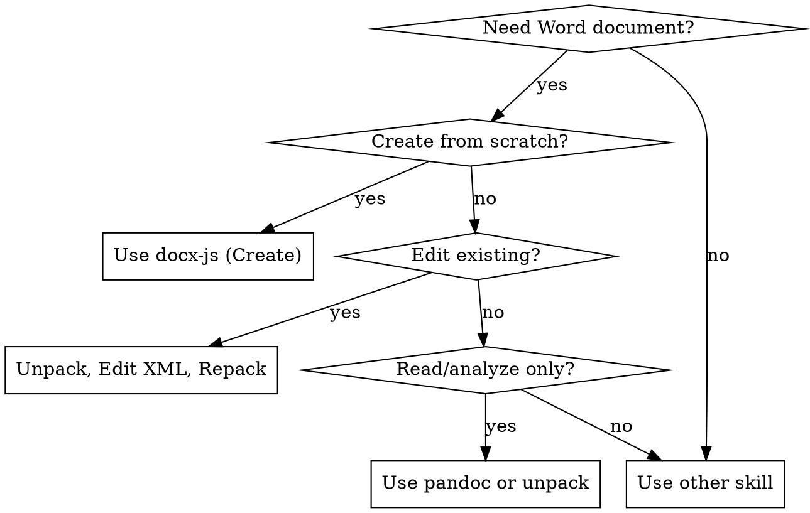

# DOCX creation, editing, and analysis

## When to Use



**Use when:** creating, reading, editing `.docx` files; tracked changes; comments; tables of contents; professional formatting.

**Do not use when:** PDF deliverable, spreadsheet, HTML report, or no document output.

## Common Mistakes

| Mistake | Consequence | Fix |
|---------|-------------|-----|
| Use `\n` for line breaks | Invalid XML | Use separate Paragraph elements |
| Use unicode bullets `•` | Breaks numbering | Use `LevelFormat.BULLET` with numbering config |
| Skip `type` in ImageRun | Error | Always specify png/jpg/etc |
| Use `WidthType.PERCENTAGE` | Breaks in Google Docs | Always use `WidthType.DXA` |
| Set only `columnWidths` | Tables render wrong | Set both `columnWidths` AND cell `width` |
| Use `ShadingType.SOLID` | Black background | Use `ShadingType.CLEAR` |
| PageBreak outside Paragraph | Invalid XML | Wrap in Paragraph |
| Skip page size | Defaults to A4 | Set explicitly for US Letter |
| Use tables as dividers | Render as empty boxes | Use paragraph borders instead |
| Skip `outlineLevel` in headings | TOC won't work | Include `outlineLevel: 0` for H1, `1` for H2, etc. |

## Overview

**Core principle:** A .docx file is a ZIP archive of XML files. Two workflows:
- **Create new:** Use `docx-js` (JavaScript) for programmatic document generation
- **Edit existing:** Unpack → edit XML → repack for precise modifications

## Quick Reference

| Task | Approach |
|------|----------|
| Read/analyze content | `pandoc` or unpack for raw XML |
| Create new document | Use `docx-js` - see Creating New Documents below |
| Edit existing document | Unpack → edit XML → repack - see Editing Existing Documents below |

### Converting .doc to .docx

Legacy `.doc` files must be converted before editing:

```bash
python scripts/office/soffice.py --headless --convert-to docx document.doc
```

### Reading Content

```bash
# Text extraction with tracked changes
pandoc --track-changes=all document.docx -o output.md

# Raw XML access
python scripts/office/unpack.py document.docx unpacked/
```

### Converting to Images

```bash
python scripts/office/soffice.py --headless --convert-to pdf document.docx
pdftoppm -jpeg -r 150 document.pdf page
```

### Accepting Tracked Changes

To produce a clean document with all tracked changes accepted (requires LibreOffice):

```bash
python scripts/accept_changes.py input.docx output.docx
```

---

## Creating New Documents

Generate .docx files with JavaScript, then validate. Install: `npm install -g docx`

### Setup
```javascript
const { Document, Packer, Paragraph, TextRun, Table, TableRow, TableCell, ImageRun,
        Header, Footer, AlignmentType, PageOrientation, LevelFormat, ExternalHyperlink,
        InternalHyperlink, Bookmark, FootnoteReferenceRun, PositionalTab,
        PositionalTabAlignment, PositionalTabRelativeTo, PositionalTabLeader,
        TabStopType, TabStopPosition, Column, SectionType,
        TableOfContents, HeadingLevel, BorderStyle, WidthType, ShadingType,
        VerticalAlign, PageNumber, PageBreak } = require('docx');

const doc = new Document({ sections: [{ children: [/* content */] }] });
Packer.toBuffer(doc).then(buffer => fs.writeFileSync("doc.docx", buffer));
```

### Validation
After creating the file, validate it. If validation fails, unpack, fix the XML, and repack.
```bash
python scripts/office/validate.py doc.docx
```

### Page Size

```javascript
// CRITICAL: docx-js defaults to A4, not US Letter
// Always set page size explicitly for consistent results
sections: [{
  properties: {
    page: {
      size: {
        width: 12240,   // 8.5 inches in DXA
        height: 15840   // 11 inches in DXA
      },
      margin: { top: 1440, right: 1440, bottom: 1440, left: 1440 } // 1 inch margins
    }
  },
  children: [/* content */]
}]
```

**Common page sizes (DXA units, 1440 DXA = 1 inch):**

| Paper | Width | Height | Content Width (1" margins) |
|-------|-------|--------|---------------------------|
| US Letter | 12,240 | 15,840 | 9,360 |
| A4 (default) | 11,906 | 16,838 | 9,026 |

**Landscape:** Pass portrait dimensions; docx-js swaps internally:
```javascript
size: { width: 12240, height: 15840, orientation: PageOrientation.LANDSCAPE }
```

### Styles (Override Built-in Headings)

Use Arial as the default font (universally supported). Keep titles black for readability.

```javascript
const doc = new Document({
  styles: {
    default: { document: { run: { font: "Arial", size: 24 } } }, // 12pt default
    paragraphStyles: [
      // IMPORTANT: Use exact IDs to override built-in styles
      { id: "Heading1", name: "Heading 1", basedOn: "Normal", next: "Normal", quickFormat: true,
        run: { size: 32, bold: true, font: "Arial" },
        paragraph: { spacing: { before: 240, after: 240 }, outlineLevel: 0 } }, // outlineLevel required for TOC
      { id: "Heading2", name: "Heading 2", basedOn: "Normal", next: "Normal", quickFormat: true,
        run: { size: 28, bold: true, font: "Arial" },
        paragraph: { spacing: { before: 180, after: 180 }, outlineLevel: 1 } },
    ]
  },
  sections: [{
    children: [
      new Paragraph({ heading: HeadingLevel.HEADING_1, children: [new TextRun("Title")] }),
    ]
  }]
});
```

### Lists (NEVER use unicode bullets)

```javascript
// ❌ WRONG - never manually insert bullet characters
new Paragraph({ children: [new TextRun("• Item")] })  // BAD
new Paragraph({ children: [new TextRun("\u2022 Item")] })  // BAD

// ✅ CORRECT - use numbering config with LevelFormat.BULLET
const doc = new Document({
  numbering: {
    config: [
      { reference: "bullets",
        levels: [{ level: 0, format: LevelFormat.BULLET, text: "•", alignment: AlignmentType.LEFT,
          style: { paragraph: { indent: { left: 720, hanging: 360 } } } }] },
      { reference: "numbers",
        levels: [{ level: 0, format: LevelFormat.DECIMAL, text: "%1.", alignment: AlignmentType.LEFT,
          style: { paragraph: { indent: { left: 720, hanging: 360 } } } }] },
    ]
  },
  sections: [{
    children: [
      new Paragraph({ numbering: { reference: "bullets", level: 0 },
        children: [new TextRun("Bullet item")] }),
      new Paragraph({ numbering: { reference: "numbers", level: 0 },
        children: [new TextRun("Numbered item")] }),
    ]
  }]
});

// ⚠️ Each reference creates INDEPENDENT numbering
// Same reference = continues (1,2,3 then 4,5,6)
// Different reference = restarts (1,2,3 then 1,2,3)
```

### Tables

**CRITICAL: Tables need dual widths** - set both `columnWidths` on the table AND `width` on each cell. Without both, tables render incorrectly on some platforms.

```javascript
// CRITICAL: Always set table width for consistent rendering
// CRITICAL: Use ShadingType.CLEAR (not SOLID) to prevent black backgrounds
const border = { style: BorderStyle.SINGLE, size: 1, color: "CCCCCC" };
const borders = { top: border, bottom: border, left: border, right: border };

new Table({
  width: { size: 9360, type: WidthType.DXA }, // Always use DXA (percentages break in Google Docs)
  columnWidths: [4680, 4680], // Must sum to table width (DXA: 1440 = 1 inch)
  rows: [
    new TableRow({
      children: [
        new TableCell({
          borders,
          width: { size: 4680, type: WidthType.DXA }, // Also set on each cell
          shading: { fill: "D5E8F0", type: ShadingType.CLEAR }, // CLEAR not SOLID
          margins: { top: 80, bottom: 80, left: 120, right: 120 }, // Cell padding (internal, not added to width)
          children: [new Paragraph({ children: [new TextRun("Cell")] })]
        })
      ]
    })
  ]
})
```

**Table width:** Use `WidthType.DXA` (never PERCENTAGE). Table width = sum of `columnWidths` = content width.
```javascript
// US Letter with 1" margins: 12240 - 2880 = 9360 DXA
width: { size: 9360, type: WidthType.DXA },
columnWidths: [7000, 2360]  // Must sum to table width
```

### Images

```javascript
// CRITICAL: type parameter is REQUIRED
new Paragraph({
  children: [new ImageRun({
    type: "png", // Required: png, jpg, jpeg, gif, bmp, svg
    data: fs.readFileSync("image.png"),
    transformation: { width: 200, height: 150 },
    altText: { title: "Title", description: "Desc", name: "Name" } // All three required
  })]
})
```

### Page Breaks

```javascript
// CRITICAL: PageBreak must be inside a Paragraph
new Paragraph({ children: [new PageBreak()] })

// Or use pageBreakBefore
new Paragraph({ pageBreakBefore: true, children: [new TextRun("New page")] })
```

### Hyperlinks

```javascript
// External link
new Paragraph({
  children: [new ExternalHyperlink({
    children: [new TextRun({ text: "Click here", style: "Hyperlink" })],
    link: "https://example.com",
  })]
})

// Internal link (bookmark + reference)
// 1. Create bookmark at destination
new Paragraph({ heading: HeadingLevel.HEADING_1, children: [
  new Bookmark({ id: "chapter1", children: [new TextRun("Chapter 1")] }),
]})
// 2. Link to it
new Paragraph({ children: [new InternalHyperlink({
  children: [new TextRun({ text: "See Chapter 1", style: "Hyperlink" })],
  anchor: "chapter1",
})]})
```

### Footnotes

```javascript
const doc = new Document({
  footnotes: {
    1: { children: [new Paragraph("Source: Annual Report 2024")] },
    2: { children: [new Paragraph("See appendix for methodology")] },
  },
  sections: [{
    children: [new Paragraph({
      children: [
        new TextRun("Revenue grew 15%"),
        new FootnoteReferenceRun(1),
        new TextRun(" using adjusted metrics"),
        new FootnoteReferenceRun(2),
      ],
    })]
  }]
});
```

### Tab Stops

```javascript
// Right-align text on same line (e.g., date opposite a title)
new Paragraph({
  children: [
    new TextRun("Company Name"),
    new TextRun("\tJanuary 2025"),
  ],
  tabStops: [{ type: TabStopType.RIGHT, position: TabStopPosition.MAX }],
})

// Dot leader (e.g., TOC-style)
new Paragraph({
  children: [
    new TextRun("Introduction"),
    new TextRun({ children: [
      new PositionalTab({
        alignment: PositionalTabAlignment.RIGHT,
        relativeTo: PositionalTabRelativeTo.MARGIN,
        leader: PositionalTabLeader.DOT,
      }),
      "3",
    ]}),
  ],
})
```

### Multi-Column Layouts

```javascript
// Equal-width columns
sections: [{
  properties: {
    column: { count: 2, space: 720, equalWidth: true, separate: true },
  },
  children: [/* content */]
}]

// Custom-width columns
sections: [{
  properties: {
    column: {
      equalWidth: false,
      children: [
        new Column({ width: 5400, space: 720 }),
        new Column({ width: 3240 }),
      ],
    },
  },
  children: [/* content */]
}]
```

Force column break with `type: SectionType.NEXT_COLUMN`.

### Table of Contents

```javascript
// CRITICAL: Headings must use HeadingLevel ONLY - no custom styles
// CRITICAL: features.updateFields is required for TOC to auto-populate when opened in Word
const doc = new Document({
  features: { updateFields: true },
  sections: [{
    children: [
      new TableOfContents("Table of Contents", { hyperlink: true, headingStyleRange: "1-3" }),
    ]
  }]
});
```

### Headers/Footers

```javascript
sections: [{
  properties: {
    page: { margin: { top: 1440, right: 1440, bottom: 1440, left: 1440 } } // 1440 = 1 inch
  },
  headers: {
    default: new Header({ children: [new Paragraph({ children: [new TextRun("Header")] })] })
  },
  footers: {
    default: new Footer({ children: [new Paragraph({
      children: [new TextRun("Page "), new TextRun({ children: [PageNumber.CURRENT] })]
    })] })
  },
  children: [/* content */]
}]
```

---

## Editing Existing Documents

**Follow all 3 steps in order.**

### Step 1: Unpack
```bash
python scripts/office/unpack.py document.docx unpacked/
```
Extracts XML, pretty-prints, merges adjacent runs, and converts smart quotes to XML entities (`&#x201C;` etc.) so they survive editing. Use `--merge-runs false` to skip run merging.

### Step 2: Edit XML

Edit files in `unpacked/word/`. See XML Reference below for patterns.

**Use "Claude" as the author** for tracked changes and comments, unless the user explicitly requests use of a different name.

**Use the Edit tool directly for string replacement. Do not write Python scripts.** Scripts introduce unnecessary complexity. The Edit tool shows exactly what is being replaced.

**CRITICAL: Use smart quotes for new content.** When adding text with apostrophes or quotes, use XML entities to produce smart quotes:
```xml
<!-- Use these entities for professional typography -->
<w:t>Here&#x2019;s a quote: &#x201C;Hello&#x201D;</w:t>
```
| Entity | Character |
|--------|-----------|
| `&#x2018;` | ‘ (left single) |
| `&#x2019;` | ’ (right single / apostrophe) |
| `&#x201C;` | “ (left double) |
| `&#x201D;` | ” (right double) |

**Adding comments:** Use `comment.py` to handle boilerplate across multiple XML files (text must be pre-escaped XML):
```bash
python scripts/comment.py unpacked/ 0 "Comment text with &amp; and &#x2019;"
python scripts/comment.py unpacked/ 1 "Reply text" --parent 0  # reply to comment 0
python scripts/comment.py unpacked/ 0 "Text" --author "Custom Author"  # custom author name
```
Then add markers to document.xml (see Comments in XML Reference).

### Step 3: Pack
```bash
python scripts/office/pack.py unpacked/ output.docx --original document.docx
```
Validates with auto-repair, condenses XML, and creates DOCX. Use `--validate false` to skip.

**Auto-repair will fix:**
- `durableId` >= 0x7FFFFFFF (regenerates valid ID)
- Missing `xml:space="preserve"` on `<w:t>` with whitespace

**Auto-repair won't fix:**
- Malformed XML, invalid element nesting, missing relationships, schema violations

**Editing tips:**
- Replace entire `<w:r>` elements when adding tracked changes
- Preserve `<w:rPr>` formatting to maintain bold, font size, etc.

---

## XML Reference

### Schema Compliance

- **Element order in `<w:pPr>`**: `<w:pStyle>`, `<w:numPr>`, `<w:spacing>`, `<w:ind>`, `<w:jc>`, `<w:rPr>` last
- **Whitespace**: Add `xml:space="preserve"` to `<w:t>` with leading/trailing spaces
- **RSIDs**: Must be 8-digit hex (e.g., `00AB1234`)

### Tracked Changes

**Insertion:**
```xml
<w:ins w:id="1" w:author="Claude" w:date="2025-01-01T00:00:00Z">
  <w:r><w:t>inserted text</w:t></w:r>
</w:ins>
```

**Deletion:**
```xml
<w:del w:id="2" w:author="Claude" w:date="2025-01-01T00:00:00Z">
  <w:r><w:delText>deleted text</w:delText></w:r>
</w:del>
```

**Inside `<w:del>`**: Use `<w:delText>` instead of `<w:t>`, and `<w:delInstrText>` instead of `<w:instrText>`.

**Minimal edits** - only mark what changes:
```xml
<!-- Change "30 days" to "60 days" -->
<w:r><w:t>The term is </w:t></w:r>
<w:del w:id="1" w:author="Claude" w:date="...">
  <w:r><w:delText>30</w:delText></w:r>
</w:del>
<w:ins w:id="2" w:author="Claude" w:date="...">
  <w:r><w:t>60</w:t></w:r>
</w:ins>
<w:r><w:t> days.</w:t></w:r>
```

**Deleting entire paragraphs/list items** - when removing ALL content from a paragraph, also mark the paragraph mark as deleted so it merges with the next paragraph. Add `<w:del/>` inside `<w:pPr><w:rPr>`:
```xml
<w:p>
  <w:pPr>
    <w:numPr>...</w:numPr>  <!-- list numbering if present -->
    <w:rPr>
      <w:del w:id="1" w:author="Claude" w:date="2025-01-01T00:00:00Z"/>
    </w:rPr>
  </w:pPr>
  <w:del w:id="2" w:author="Claude" w:date="2025-01-01T00:00:00Z">
    <w:r><w:delText>Entire paragraph content being deleted...</w:delText></w:r>
  </w:del>
</w:p>
```
Without the `<w:del/>` in `<w:pPr><w:rPr>`, accepting changes leaves an empty paragraph/list item.

**Rejecting another author's insertion** - nest deletion inside their insertion:
```xml
<w:ins w:author="Jane" w:id="5">
  <w:del w:author="Claude" w:id="10">
    <w:r><w:delText>their inserted text</w:delText></w:r>
  </w:del>
</w:ins>
```

**Restoring another author's deletion** - add insertion after (don't modify their deletion):
```xml
<w:del w:author="Jane" w:id="5">
  <w:r><w:delText>deleted text</w:delText></w:r>
</w:del>
<w:ins w:author="Claude" w:id="10">
  <w:r><w:t>deleted text</w:t></w:r>
</w:ins>
```

### Comments

After running `comment.py` (see Step 2), add markers to document.xml. For replies, use `--parent` flag and nest markers inside the parent's.

**CRITICAL: `<w:commentRangeStart>` and `<w:commentRangeEnd>` are siblings of `<w:r>`, never inside `<w:r>`.**

```xml
<!-- Comment markers are direct children of w:p, never inside w:r -->
<w:commentRangeStart w:id="0"/>
<w:del w:id="1" w:author="Claude" w:date="2025-01-01T00:00:00Z">
  <w:r><w:delText>deleted</w:delText></w:r>
</w:del>
<w:r><w:t> more text</w:t></w:r>
<w:commentRangeEnd w:id="0"/>
<w:r><w:rPr><w:rStyle w:val="CommentReference"/></w:rPr><w:commentReference w:id="0"/></w:r>

<!-- Comment 0 with reply 1 nested inside -->
<w:commentRangeStart w:id="0"/>
  <w:commentRangeStart w:id="1"/>
  <w:r><w:t>text</w:t></w:r>
  <w:commentRangeEnd w:id="1"/>
<w:commentRangeEnd w:id="0"/>
<w:r><w:rPr><w:rStyle w:val="CommentReference"/></w:rPr><w:commentReference w:id="0"/></w:r>
<w:r><w:rPr><w:rStyle w:val="CommentReference"/></w:rPr><w:commentReference w:id="1"/></w:r>
```

### Images

1. Add image file to `word/media/`
2. Add relationship to `word/_rels/document.xml.rels`:
```xml
<Relationship Id="rId5" Type=".../image" Target="media/image1.png"/>
```
3. Add content type to `[Content_Types].xml`:
```xml
<Default Extension="png" ContentType="image/png"/>
```
4. Reference in document.xml:
```xml
<w:drawing>
  <wp:inline>
    <wp:extent cx="914400" cy="914400"/>  <!-- EMUs: 914400 = 1 inch -->
    <a:graphic>
      <a:graphicData uri=".../picture">
        <pic:pic>
          <pic:blipFill><a:blip r:embed="rId5"/></pic:blipFill>
        </pic:pic>
      </a:graphicData>
    </a:graphic>
  </wp:inline>
</w:drawing>
```

---

## Tiếng Việt và Unicode

### Hỗ trợ sẵn có

docx-js lưu file theo chuẩn XML UTF-8 — mọi ký tự Unicode (kể cả tiếng Việt có dấu) đều được hỗ trợ sẵn mà không cần cấu hình thêm.

### Font chữ

Không phải font nào cũng hiển thị đúng tiếng Việt. Ưu tiên dùng:

| Font | Hỗ trợ tiếng Việt |
|------|-------------------|
| **Arial** | ✅ Đầy đủ (khuyên dùng) |
| **Times New Roman** | ✅ Đầy đủ |
| **Calibri** | ✅ Đầy đủ |
| **Courier New** | ✅ Đầy đủ |

```javascript
// Đặt font mặc định hỗ trợ tiếng Việt
const doc = new Document({
  styles: {
    default: { document: { run: { font: "Arial", size: 24 } } },
  },
  sections: [{
    children: [
      new Paragraph({ children: [new TextRun("Xin chào! Đây là văn bản tiếng Việt.")] }),
    ]
  }]
});
```

### Lưu ý khi soạn script Node.js

- **Encoding source file**: Lưu script `.js` dưới dạng UTF-8 (không BOM). Với Node.js trên Windows, thêm dòng đầu nếu cần:
  ```javascript
  // Đảm bảo stdout/stderr xuất UTF-8
  process.stdout.setEncoding('utf8');
  ```
- **String literal**: Có thể viết thẳng ký tự Unicode trong chuỗi:
  ```javascript
  new TextRun("Hợp đồng lao động – Phụ lục đính kèm")
  // KHÔNG cần escape: \u1EE3, \u0103, v.v.
  ```
- **XML smart quotes**: Khi chỉnh sửa XML thủ công, viết thẳng ký tự tiếng Việt trong `<w:t>` — XML đã là UTF-8:
  ```xml
  <w:t>Điều khoản và điều kiện</w:t>
  ```

---

## Dependencies

- **pandoc**: Text extraction
- **docx**: `npm install -g docx` (new documents)
- **LibreOffice**: PDF conversion (auto-configured for sandboxed environments via `scripts/office/soffice.py`)
- **Poppler**: `pdftoppm` for images
